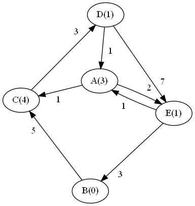

## Exploration
For this section, consider the following graph. Numbers in parentheses indicate the heuristic distance to B.:

1. First, let's find the shortest path from A to B, using Dijkstra's (this should look familiar from last week's worksheet). We will keep track of the total cost of the path so far in parentheses, and always pick the path with the lowest cost.
   
   You can either create a table elsewhere and submit a picture/screenshot or do this directly in this document; if you do the latter, note that the pipes (`|`) do not have to align. You should add more rows if necessary.
  
   | Step |    Frontier    | Path | Visited |   New Neighbors  |
    | ---- | -------------- | ---- | ------- | ---------------- |
    | 1    | A (0)          | A    | A       | AC (1), AE (2)   |
    | 2    | AC (1), AE (2) | AC   | A, C    | ACD (4)          |
    | 3    |                |      |         |                  |
    | 4    |                |      |         |                  |
    | 5    |                |      |         |                  |
    | 6    |                |      |         |                  |
    | 7    |                |      |         |                  |
    | 8    |                |      |         |                  |

2. Complete the below table for A* search. As before, we keep track of the cost in parentheses. Now, however, total cost = path cost + heuristic value.
   
   You can either create a table elsewhere and submit a picture/screenshot or do this directly in this document; if you do the latter, note that the pipes (`|`) do not have to align. You should add more rows if necessary.

   | Step |    Frontier    | Path | Visited |   New Neighbors  |
    | ---- | -------------- | ---- | ------- | ---------------- |
    | 1    | A (3)          | A    | A       | AC (5), AE (3)   |
    | 2    |                |      |         |                  |
    | 3    |                |      |         |                  |
    | 4    |                |      |         |                  |
    | 5    |                |      |         |                  |
    | 6    |                |      |         |                  |
    | 7    |                |      |         |                  |
    | 8    |                |      |         |                  |

3. Is the final path found by A* the same or different as the path found by Dijkstra's? If the same, why might we choose one algorithm over the other? If different, what caused the difference?
4. What is the time and space complexity of Dijkstra's algorithm? Explain.
5. What is the time and space complexity of A* search? Explain.
6. Now, let's consider the [Traveling Salesman Problem (TSP)](https://opendsa-server.cs.vt.edu/ODSA/Books/Everything/html/TSP.html), which asks whether, given a weighted (optionally directed) graph, there is a path that visits all nodes with cost of at most *k*. TSP is a known NP-complete problem.
Using the graph above, does there exist a path that visits every node exactly once, with a total cost of 13 or less (TSP does not use heuristics)? If you believe there is such a path, please give it as your answer.
7. Briefly describe how you tried to answer the previous question. I am not looking for pseudocode here, just an explanation of what you did in your head (or on paper) to try to find the path.
8. Come up with an algorithm that uses Dijkstra's that would solve TSP. That is, come up with an algorithm that, given a weighted graph and a maximum cost *k*, will either find a path that visits every node exactly once with at most cost *k*, or report that no such path exists. What is the complexity of your algorithm, in terms of *V* and *E* (the number of vertices and edges, respectively)?
## Challenge

A* search is often used to search through [state space](https://en.wikipedia.org/wiki/State_space), or the space of possible states. State space is represented as a graph, with states as nodes and transitions as edges. As an example, consider solving a [Rubik's Cube](https://en.wikipedia.org/wiki/Rubik%27s_Cube). Your starting state is the configuration of the cube, as it is handed to you. Your goal state is the cube with each face/color completed. Intermediate states would be the other possible configurations of the cube. Edges would be the rotations that cause transitions between states.

In questions 1-3 of this worksheet, we are going to consider a slightly less challenging problem: The [8 Puzzle](https://en.wikipedia.org/wiki/15_puzzle). If you aren't familiar with this type of puzzle, please read the Wikipedia article before answering the following questions.

1. What is a state in the 8 Puzzle? What are the transitions/edges?
2. According to the Wikipedia article, what are two possible heuristics that can be used for solving the 8 Puzzle? Describe each one (you may click through from the Wikipedia page to read more about them, or use Google).
3. Consider the following heuristic for the 8 Puzzle: the sum of all values surrounding the empty space. Why is this a bad heuristic? Why are the heuristics in question 2 better?  

Next, we will walk through a proof-sketch of why the [Traveling Salesman Problem (TSP)](https://opendsa-server.cs.vt.edu/ODSA/Books/Everything/html/TSP.html) is NP-compete. TSP asks the question of whether, given a weighted (optionally directed) graph, there is a path that visits all nodes with cost of at most *k*.  

4. Explain why TSP is in NP (that is, why it only takes polynomial time to verify a solution).

One way we can proof that TSP is NP-hard is to show that it is as difficult to solve as another known NP-hard problem. In particular, if we can convert any instance of a known NP-hard problem into an instance of TSP, we will know that TSP is at least as difficult. It is a proof by contradiction:

> 1. Assumption: Problem A is difficult to solve (ie. it is NP-hard).
> 
> 2. Assumption: We can convert Problem A to Problem B and back easily (ie. this process takes polynomial time), such that the instance of Problem A is solvable if and only if the instance of Problem B is solvable.
> 
> 3. Hypothesis: Problem B is easy to solve (i.e. it is not NP-hard).
> 
> 4. If Hypothesis 3 is true, then we could easily solve Problem A by:
> 
>     1. converting it to Problem B (which is easy, by Assumption 2)
> 
>     2. solving Problem B (which is easy, by Hypothesis 3)
> 
>     3. converting it back to Problem A (which is easy, by Assumption 2).
> 
> 5. This contradicts Assumption 1, so Hypothesis 3 must be wrong.
> 
> 6. Conclusion: Problem B must be difficulty to solve (ie. it is NP-hard).

The algorithm in Assumption 2 is called a *reduction*. In our case, TSP is our "Problem B", and we will be using the [Hamiltonian Cycle problem](https://opendsa-server.cs.vt.edu/ODSA/Books/Everything/html/hamiltonianCycle.html) as our "Problem A". Hamiltonian Cycle asks the question of whether, given a graph, there is a path that visits every node exactly once and ends up at the starting node. We will assume/already know that Hamiltonian Cycle is NP-complete (and therefore NP-hard). Clearly these two problems are similar - but can one be converted into the other?

Coming up with a reduction is difficult, so the focus here is on you understanding how this reduction works. The details can be found in the [OpenDSA textbook](https://opendsa-server.cs.vt.edu/ODSA/Books/Everything/html/hamiltonianCycle_to_TSP.html), as well as other places online.

5. In your own words, explain how to take an instance of Hamiltonian Cycle (i.e., a graph) and turn it into an instance of TSP (i.e., a different weighted graph, with some maximum acceptable path cost *k*). Be sure to explain how you would pick *k*.

6. Explain why this reduction/construction of the new graph takes only polynomial time.

7. Explain why, if there is a Hamiltonian Cycle in the original graph, there *must* be a path of at most cost *k* in the new weighted graph.

8. Explain why, if there *isn't* a Hamiltonian Cycle in the original graph, there must *not* be a path of at most cost *k* in the new weighted graph.

9. Explain why, given the above, we can therefore say that TSP is NP-hard, and that therefore TSP is NP-complete.
